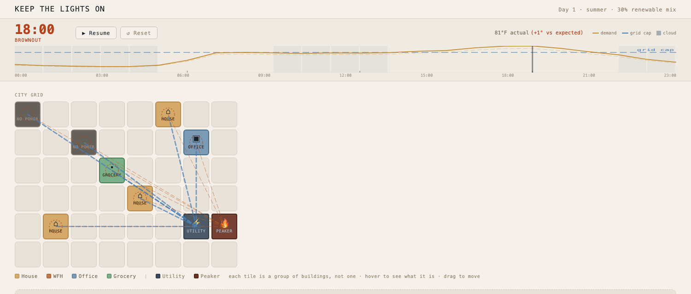

# Keep the Lights On

Plan a city's power day. Then run it against real weather and find out what you got wrong.

**[Play it → keepthelightson.shawna.dev](https://keepthelightson.shawna.dev)**



---

## The idea

Most energy games make you a builder: place things, watch a number go up. This one makes you a **planner**, and then makes you live with the plan.

While you build, the dashboard shows an **estimate** — the day you should expect, on typical weather. Press **Run Day** and the sim rolls the actual weather: clouds drift in, the afternoon runs hotter than forecast, a contingency knocks a few percent off grid capacity. The day plays out hour by hour, and the dashboard reports what *actually* happened against what you predicted.

The gap between those two numbers is the whole game.

## What it's actually about

Three things that are true about real grids and surprising to most people:

**Blackouts drop circuits, not buildings.** Each tile on the map is a group of buildings wired together, not a single house. When supply runs short, the grid switches off whole groups in a pre-set order — homes first, critical loads last. That's a real document at a real utility, not an improvisation in the moment.

**Clean ≠ no gas peaker.** You can tune a city until the peaker plant never fires and still be running dirty, because the everyday baseload behind the wall is itself mostly fossil. Carbon tracks your grid's generation mix, not just the visible emergency plant. Getting the peaker to zero and watching CO₂ stay high is the intended discovery.

**Margin is a decision, not a detail.** A plan that exactly meets expected demand fails roughly half the time, because expected weather is the middle of a distribution, not a promise. Reserve margin is what a plan costs to survive a bad roll.

## Under the hood

No backend. No API calls. The entire simulation is client-side math over a 24-hour clock.

Each hour, supply is dispatched in merit order — solar first, then stored battery energy, then baseload grid import, then the gas peaker as a last resort — and whatever demand remains unserved forces load shedding by priority tier.

The engine was built and tested **before any UI existed**, against a calibration anchor: a fixed starting city of five residential circuits, a grocery, and an office, on a hot day with no solar and no storage, which must produce about two hours of evening brownout with houses dark and the grocery still lit. Every other number in the game is tuned around that anchor. It runs on deterministic weather so the test can't drift; randomness is reserved for actual play.

```
src/engine/    shapes · weather · dispatch · metrics   ← the sim
src/state/     city model, grid layout, levers
src/ui/        grid, day clock, flow arrows, dashboards
```

## Running it locally

```bash
npm install
npm run dev      # http://localhost:5173
npm test         # engine test suite
npm run build    # production build
```

Requires Node 18+. React + Vite, no other runtime dependencies.

## Status

Playable, and still being built. The engine, the grid, and the Run Day reveal are done — you can drag circuits around the map, run days, and watch a plan fail on a bad weather roll.

Not finished yet: the climate levers (temperature, cloud cover, season, renewable mix), placing your own solar and batteries, and the off-grid waiver that cuts the utility entirely and leaves the city running on whatever you built. Those land next, and the engine already supports all of them.

Design docs — the product spec, the build brief, and an archive of UI copy — are in the repo root, if you want to see the thinking rather than just the code.
